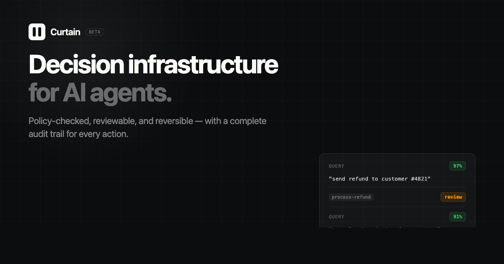
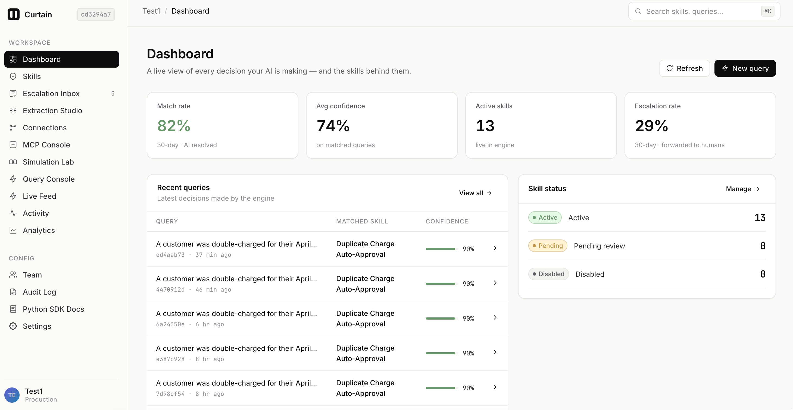
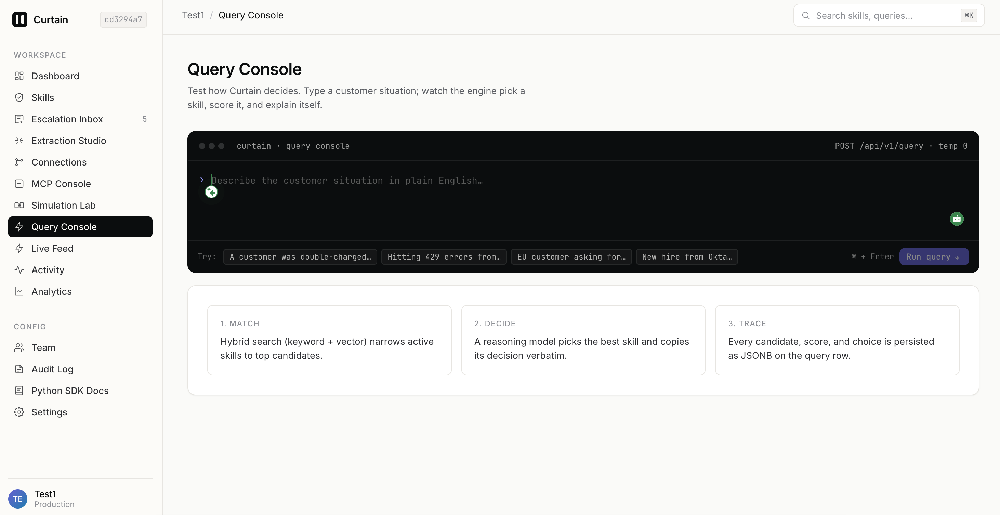
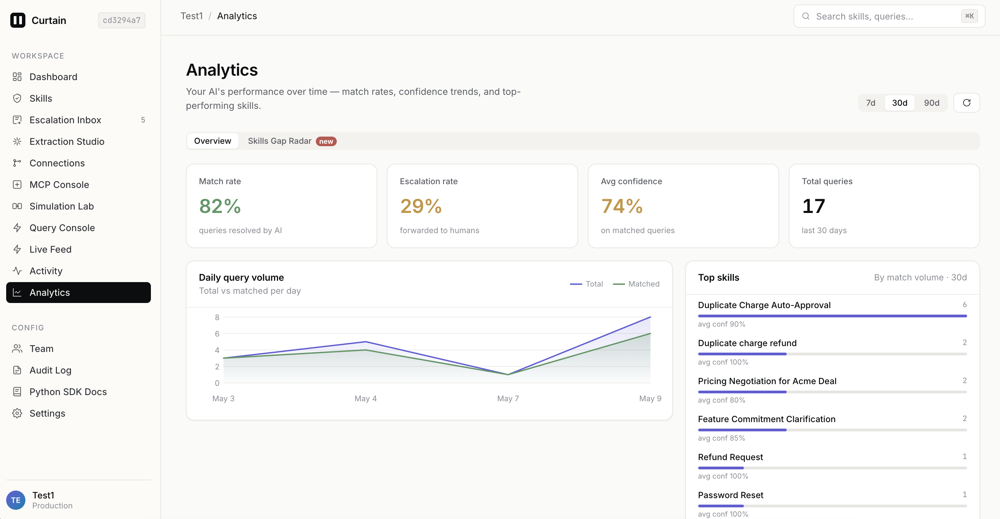

<div align="center">
  

  <br/><br/>

  [](https://nodejs.org)
  [](https://www.typescriptlang.org)
  [](https://supabase.com)
  [](https://openai.com)
  [](LICENSE)

  <br/>

  > **Decision infrastructure for AI agents.**
  > Policy-checked, reviewable, and reversible — with a complete audit trail for every action.

  <br/>

  [Live Demo](https://curtainai.in) &nbsp;·&nbsp; [Quick Start](#quick-start) &nbsp;·&nbsp; [API](#api-reference)

</div>

---

<div align="center">
  
</div>

---

## Demo

<div align="center">
  <a href="https://youtu.be/l0PxZbWFdoA">
    <br/>
    
  </a>
</div>

---

## What Is Curtain AI?

Think about how a great support team works. They have experienced agents who know exactly what to do in every situation — when to approve a refund, when to escalate a complaint, when to offer a discount. Over years, that knowledge lives in people's heads. When those people leave, the knowledge walks out with them. New agents make different calls on the same issue. Customers get inconsistent answers. Nothing is written down.

**Curtain AI is where that institutional knowledge lives permanently.**

You take every decision your team makes — every policy, every standard response, every rule — and turn it into a **Skill**. A Skill is simple: it has a trigger ("when a customer asks for a refund on a damaged item") and a decision ("verify the damage with a photo, then issue a full refund within 24 hours"). Once your Skills are defined, any AI agent — a chatbot, an automation, a support tool — can query Curtain and get the right decision back in milliseconds, every single time, with a confidence score attached.

No more inconsistency. No more guessing. No more "it depends on who picks up the ticket."

**The human stays in control.** Every new Skill goes through an approval step before it goes live — your team reviews it, adjusts it, and signs off. If a customer query doesn't match any Skill confidently, Curtain doesn't guess. It escalates to a human, logs the gap, and helps you build a new Skill to cover it next time. Every decision Curtain makes is stored with a full audit trail — you can see exactly which Skill fired, what confidence it had, and whether a human later overrode it.

Over time, Curtain learns the shape of your support operation. You can simulate the impact of a Skill change before deploying it, extract new Skills automatically from past conversations, and track exactly how well each Skill is performing. It's the decision layer your AI agents were missing.

---

## How It Works

```
Sample Workspace id :- 9e091037-af87-48a1-b8f8-aa1225988016
Api key :- cai_56bf852488119dfec00efc2114ef9be08d0169a297a01638d86bfa0fc7608624
```

```
Define Skills  →  Connect your agent  →  Query comes in  →  Decision returned (or escalated)
```

**1. Define a Skill** — Give it a trigger and a decision:
```
Trigger: "customer requests a refund"
Decision: "Verify order is within 30 days, then approve and send confirmation."
```

**2. Approve it** — Skills go through a review step before they go live. Nothing runs in production without your sign-off.

**3. Your agent queries Curtain** — Send any customer message. Curtain finds the best matching Skill and returns the decision with a confidence score.

**4. Escalate when unsure** — If no Skill matches confidently, Curtain automatically flags it for human review.

---

## Screenshots

> Drop your own screenshots into `docs/screenshots/` to replace these placeholders.

**Dashboard — Manage your Skills**

<div align="center">
  
</div>

**Query Console — Test live**

<div align="center">
  
</div>

**Analytics — Track performance**

<div align="center">
  
</div>

---

## Quick Start

**You'll need:** Node.js 18+, a [Supabase](https://supabase.com) project (free tier works), and an [OpenAI](https://platform.openai.com) API key.

### 1. Clone and install

```bash
git clone https://github.com/NDISBACK/curtain-ai.git
cd curtain-ai
npm install
```

### 2. Set up your environment

```bash
cp .env.example .env
```

Fill in these five values in `.env`:

```env
SUPABASE_URL=https://your-project.supabase.co
SUPABASE_ANON_KEY=your-anon-key
SUPABASE_SERVICE_ROLE_KEY=your-service-role-key
OPENAI_API_KEY=sk-...
OPENAI_MODEL=gpt-4o
```

### 3. Run the database migrations

Open **Supabase → SQL Editor** and run these files in order (they're in `supabase/migrations/`):

```
001_initial_schema.sql
002_api_keys_and_workspace_config.sql
003_vector_embeddings.sql
004_skill_versions.sql
005_analytics.sql
006_integrations.sql
007_enterprise.sql
```

### 4. Create your workspace

```bash
npx tsx scripts/bootstrap-workspace.ts "My Company"
# Prints your Workspace ID and API key — save both, the key is shown once
```

### 5. Start the server

```bash
npm run dev
# Running at http://localhost:3000
```

Open **http://localhost:3000**, enter your Workspace ID and API key, and you're in.

---

## Create Your First Skill

```bash
curl -X POST http://localhost:3000/api/v1/skills \
  -H "Authorization: Bearer cai_your_api_key" \
  -H "Content-Type: application/json" \
  -d '{
    "name": "Process Refund",
    "trigger_condition": "customer requests a refund",
    "decision": "Check order date. If within 30 days, approve the refund.",
    "escalation_required": false
  }'
```

Then approve it so it goes live:

```bash
curl -X PATCH http://localhost:3000/api/v1/skills/SKILL_ID/approve \
  -H "Authorization: Bearer cai_your_api_key"
```

Then query it:

```bash
curl -X POST http://localhost:3000/api/v1/query \
  -H "Authorization: Bearer cai_your_api_key" \
  -H "Content-Type: application/json" \
  -d '{"query": "I want my money back for order #4821"}'

# Response:
# {
#   "decision": "Check order date. If within 30 days, approve the refund.",
#   "confidence": 0.97,
#   "escalate": false
# }
```

---

## Architecture

```
Browser / AI Agent
        ↓
   Express API  ←→  MCP Server (for AI agents)
        ↓
    Services  ←→  OpenAI (match + extract)
        ↓
   Supabase (Postgres + vector search)
```

Skills are stored in Postgres. When a query arrives, Curtain embeds it using OpenAI, finds the closest Skills using vector + keyword search, then uses GPT-4o to pick the best one. The whole decision trace is saved so you can audit every choice later.

---

## API Reference

All requests (except `/health` and creating a workspace) need:
```
Authorization: Bearer cai_your_api_key
```

**Rate limit:** 100 requests/minute per workspace.

| Method | Path | Description |
|--------|------|-------------|
| `GET` | `/api/v1/health` | Health check |
| `POST` | `/api/v1/workspaces` | Create workspace |
| `GET` | `/api/v1/workspaces/:id` | Get workspace |
| `GET` | `/api/v1/skills` | List skills |
| `POST` | `/api/v1/skills` | Create a skill |
| `PATCH` | `/api/v1/skills/:id/approve` | Approve → live |
| `PATCH` | `/api/v1/skills/:id/disable` | Disable a skill |
| `GET` | `/api/v1/skills/export` | Export as OpenAI / MCP / LangChain format |
| `POST` | `/api/v1/skills/import` | Bulk import skills |
| `POST` | `/api/v1/query` | Run a query |
| `POST` | `/api/v1/query/override` | Submit a human correction |
| `GET` | `/api/v1/queries` | Query history |
| `POST` | `/api/v1/extract` | Extract skills from a conversation transcript |
| `GET` | `/api/v1/workspaces/:id/analytics` | Workspace analytics |
| `GET` | `/api/v1/skills/:id/analytics` | Per-skill analytics |
| `POST` | `/mcp/v1` | MCP endpoint (JSON-RPC 2.0) for AI agents |

---

## Integrations

Connect your existing support channels to automatically extract Skills from past conversations:

- **Gmail** — OAuth sync of resolved support threads
- **Freshdesk** — API key sync of closed tickets
- **WhatsApp** — Business API message history

---

## Environment Variables

| Variable | Required | Description |
|----------|:--------:|-------------|
| `SUPABASE_URL` | Yes | Supabase project URL |
| `SUPABASE_ANON_KEY` | Yes | Supabase anon key |
| `SUPABASE_SERVICE_ROLE_KEY` | Yes | Supabase service role key |
| `OPENAI_API_KEY` | Yes | OpenAI API key |
| `OPENAI_MODEL` | No (default: `gpt-4o`) | Model used for ranking |
| `PORT` | No (default: `3000`) | Server port |
| `GOOGLE_CLIENT_ID` / `SECRET` | No | For Gmail integration |

---

## License

MIT — see [LICENSE](LICENSE).

---

<div align="center">
  <strong>Curtain AI</strong> — curtainai.in
</div>
